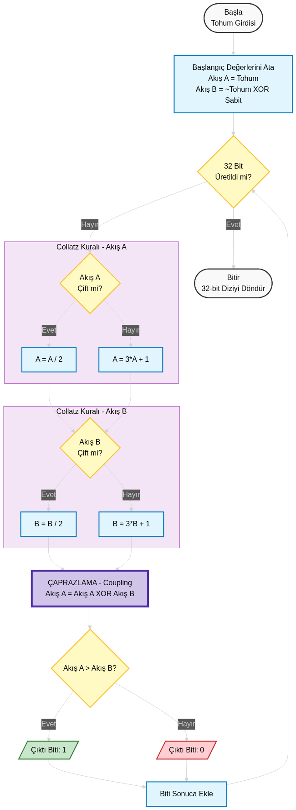

<div align="center">

# 🎲 Collatz DualStream PRNG

[](https://www.python.org/)
[](https://github.com/syhnshn/BSG-collatz-dual-stream-prng)
[](https://tr.wikipedia.org/wiki/Collatz_san%C4%B1s%C4%B1)
[](LICENSE)

_Kaotik Collatz Sanısı ve **"Çift Akış" (Coupled Streams)** mimarisine dayalı özgün bir Sözde Rastgele Sayı Üreteci._

---



<br>
<i> Kaosun Mimarisi: Entropi üretmek için yarışan ve çarpışan iki sayı akışı.</i>
<br><br>

</div>

---

## 🇹🇷 Proje Hakkında

**CollatzDualStream**, standart ve sıkıcı rastgele sayı üreteçlerine bir alternatif olarak tasarlanmış, görsel ve matematiksel olarak tatmin edici deneysel bir algoritmadır.

Temelinde ünlü **Collatz Sanısı** (3n+1 Problemi) yatar. Ancak bu algoritma tek bir sayıyı takip etmek yerine, **birbirine dolanmış iki farklı sayı akışını** aynı anda çalıştırır ve yarıştırır.

### ✨ Öne Çıkan Özellikler

- **⚡ Çift Motorlu Yapı:** Sistem, `Stream A` ve `Stream B` olmak üzere iki bağımsız motordan güç alır.
- **🔗 Dinamik Çaprazlama (Coupling):** Akışlar birbirinden kopuk değildir! Her adımda `Stream A`, o anki `Stream B` ile **XOR işlemine** tabi tutularak "kirlenir". Bu, gidişatın tahmin edilmesini imkansız hale getirir.
- **🏁 Yarış Mantığı:** Üretilen her bit (`0` veya `1`), o an "Hangi sayı daha büyük?" sorusunun cevabına göre belirlenir. Bu da algoritmayı bir sayı yarışına dönüştürür.

### 🚀 Nasıl Çalışır?

1.  **Başlangıç (Seed):** Girdiğiniz tohum değeri parçalanarak iki farklı başlangıç noktası oluşturulur.
2.  **Collatz Kuralı:** Her iki akışa da Collatz haritası uygulanır (çiftse yarısı, tekse 3 katının 1 fazlası).
3.  **Etkileşim:** `stream_a = stream_a ^ stream_b` işlemi ile doğrusal olmayan bir karışım sağlanır.
4.  **Sonuç:** Akışların büyüklük ilişkisine göre `1` veya `0` üretilir ve 32 bite tamamlanana kadar döngü sürer.

---

### 🛠️ Kurulum ve Kullanım

1.  **Projeyi Klonlayın:**

    ```bash
    git clone https://github.com/syhnshn/BSG-collatz-dual-stream-prng.git
    cd BSG-collatz-dual-stream-prng
    ```

2.  **Çalıştırın:**

    ```bash
    python collatz_dual_stream.py
    ```

3.  **Sonucu İzleyin:**
    Sizden bir tam sayı (tohum) girmeniz istenecek. Ardından, algoritmanın **ilk 5 adımını görselleştiren** özel demo ekranı ve üretilen 32-bitlik rastgele dizi karşınıza çıkacak.

### 📊 Örnek Çıktı

```text
Enter an integer seed to start the generator: 12345

Initialized with seed: 12345

=== Collatz DualStream Architecture Demo ===
Step   | Stream A             | Stream B             | Coupling (A^B)  | Bit
--------------------------------------------------------------------------------
#1     | 12345   -> 37036     | 8337277144 -> ...    | 8337248372      | 0
...

[OUTPUT] 32-Bit Generated Sequence:
> 00010101111010101111111111000101
```

---

<div align="center">

**[Seyhan](https://github.com/syhnshn) tarafından ❤️ ile geliştirilmiştir.**

</div>
